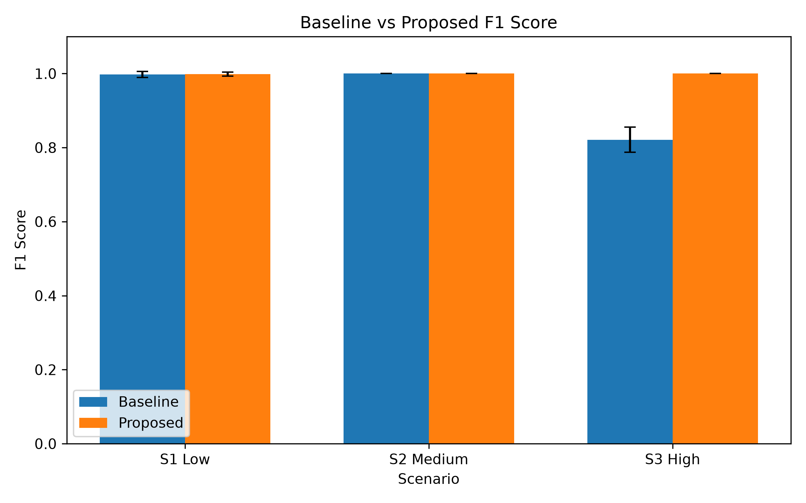
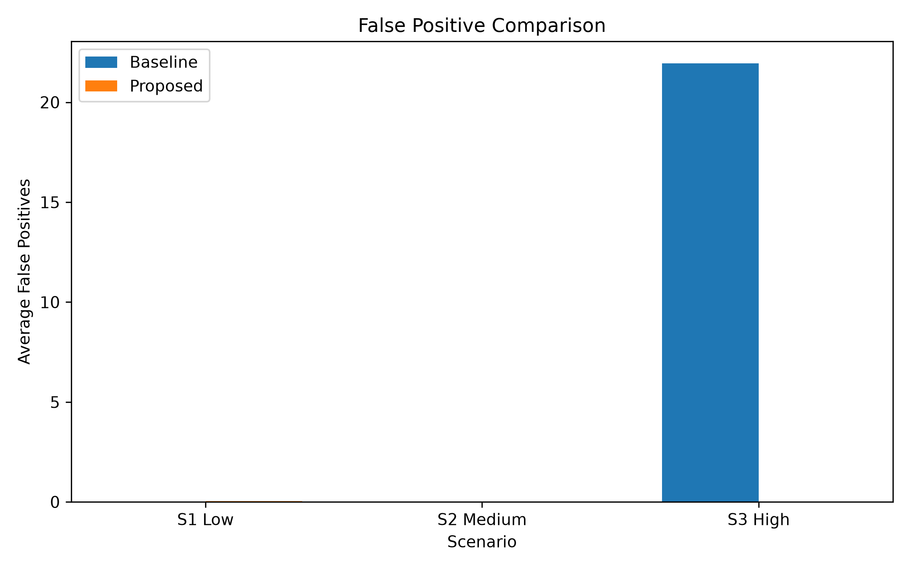
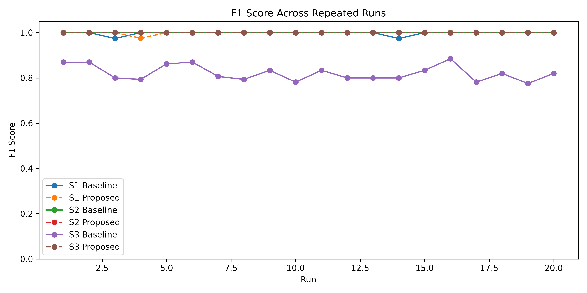

# Real-Time Network Attack / Anomaly Detector

A real-time network anomaly detection system that compares a traditional fixed-threshold detector with a proposed adaptive anomaly detector.

## Overview

The project detects suspicious network behaviour using traffic-level metadata and compares:

- **Baseline:** fixed threshold-based detection
- **Proposed:** adaptive EWMA-style learning with weighted z-score anomaly detection

The system includes a Streamlit dashboard for live simulation, repeated-run evaluation, visualization, and comparison of detection performance.

## Key Features

- Real-time traffic simulation
- Baseline vs proposed detector comparison
- Adaptive anomaly detection
- EWMA-based traffic profiling
- Weighted anomaly scoring
- Runtime threshold controls
- F1-score, precision and recall evaluation
- False-positive comparison
- Repeated-run statistical evaluation
- Streamlit visualization
- Optional real packet metadata capture

## Detection Method

### Baseline Detector

The baseline uses fixed thresholds for:

- Packet rate
- Destination diversity
- Failed/TCP connection behaviour

If a traffic feature exceeds its fixed threshold, an alert is generated.

### Proposed Adaptive Detector

The proposed method:

1. Learns the normal traffic profile during a warm-up period.
2. Updates the profile using EWMA-style adaptation.
3. Calculates normalized z-score deviations.
4. Combines multiple anomaly signals using weighted scoring.
5. Generates an alert when the final anomaly score exceeds the configured threshold.

This allows the detector to adapt to changing traffic conditions and reduce unnecessary alerts.

## Experimental Scenarios

| Scenario | Description |
|---|---|
| S1 | Low-load traffic |
| S2 | Medium-load traffic |
| S3 | High-load / highly variable traffic |

The evaluation uses synthetic traffic so that the experiments are safe, reproducible, and do not require generating real attacks.

## Results

The system was evaluated using 20 repeated runs.

| Scenario | Baseline F1 | Proposed F1 | Baseline FP | Proposed FP |
|---|---:|---:|---:|---:|
| S1 | 0.997 | **0.999** | 0.00 | 0.05 |
| S2 | 1.000 | **1.000** | 0.00 | 0.00 |
| S3 | 0.821 | **1.000** | 21.95 | **0.00** |

### Result Visualizations

#### F1 Score Comparison


#### False Positive Comparison


#### Repeated-Run F1 Scores


### Main Result

The largest improvement occurs in **S3**, where the proposed adaptive detector:

- improves F1-score from **0.821 → 1.000**
- reduces average false positives from **21.95 → 0.00**

This demonstrates the advantage of adaptive detection under highly variable traffic conditions.

## Dashboard

The Streamlit dashboard provides:

- Scenario selection
- Adaptive z-threshold control
- Anomaly-score threshold control
- Repeated-run configuration
- Live anomaly-score visualization
- Baseline and proposed detector decisions
- Simulation summary

## Project Structure

```text
network-anomaly-detector/
│
├── app.py
├── live_capture.py
├── make_graphs.py
├── run_evaluation.py
├── requirements.txt
├── README.md
│
├── src/
│   ├── config.py
│   ├── detectors.py
│   ├── evaluate.py
│   └── traffic.py
│
├── results/
│   ├── f1_comparison.png
│   ├── false_positive_comparison.png
│   ├── repeated_runs_f1.png
│   ├── repeated_runs.csv
│   └── summary_results.csv
│
└── reports/